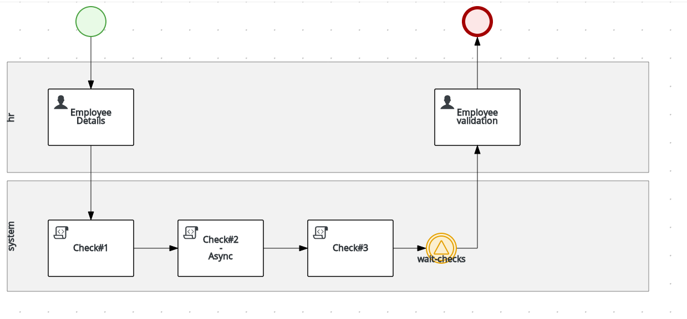

jbpm-spring-boot example
=============================

Example of a jbpm service with spring boot.<br>
The project is composed by a kjar, representing a sample new-hire BPMN process and by a kie-server running on spring boot.<br>

This is an image showing the BPMN process:


## OpenShift Environment installation

### Prerequisites

You need an OpenShift cluster version 3.11 to run the application.<br>
You can also use minishift or oc cluster.

You need the OpenShift CLI (oc command) on your machine in order to use the launch.sh script.

You need Docker on your machine to build the images.

### Openshift installation

Deployment on OpenShift has been perfomed using the maven fabric8 plugin; openshift resources are into folder: *src/main/fabric8*:

Image Build:

```bash
mvn fabric8:build -Dfabric8.namespace=${build_environment}
```

Generate & Apply DeploymentConfig:

```bash
mvn fabric8:resource fabric8:resource-apply -Dfabric8.openshift.enableAutomaticTrigger=false -Dfabric8.openshift.imageChangeTrigger=false -Dfabric8.namespace=${deploy_environment} -Dfabric8.generator.name=docker-registry.default.svc:5000/${build_environment}/${service_name}:1.0.0
```

Deploy to OpenShift:

```bash
oc rollout latest dc/${deploy_config} -n ${deploy_environment}
```


## Local Environment installation

### Prerequisites (if you want monitoring via business central)

You need an existing PAM business central listening at localhost:8080 (for monitoring the kie server).<br>
You need to define these two properties for the business central in order to monitor the kie-server:
```bash
<property name="org.kie.server.user" value="user"/>
<property name="org.kie.server.pwd" value="user"/>
```

### Install the kjar in your .m2 repo

```bash
  cd new-hire-kjar
  mvn clean install
```

### Define the kie server properties

The list of kie containers (groupId, artifactId version) to deploy at startup must be defined inside the new-hire-service.xml file.<br>
The kjars must exists inside your local .m2 maven repository.

Several application.properties are defined, each one with a specific database configuration:
 - h2 (default)
 - mysql
 - postgres
 - oracle

You can configure the user/password to connect with the controller (Business Central) through the following system properties inside the new-hire-service.xml file:

```bash
 org.kie.server.controller.user=<user>
 org.kie.server.controller.pwd=<password>
```

### Custom Rest endpoint

A custom rest endpoint, registered under path /rest/pam is available and it adds additional APIs to the kie server.

### Run a kie-server and deploy a kjar

```bash
  cd new-hire-service
  mvn clean install && mvn spring-boot:run -Dspring-boot.run.fork=false -Dorg.kie.server.startup.strategy=LocalContainersStartupStrategy -Dspring.profiles.active=h2 -Ph2
```

### Run a kie-server and deploy a kjar with mysql dbms

```bash
  cd new-hire-service
  mvn clean install && mvn spring-boot:run -Dspring-boot.run.fork=false -Dorg.kie.server.startup.strategy=LocalContainersStartupStrategy -Dspring.profiles.active=mysql -Pmysql
```

### Run a kie-server and deploy a kjar with postgres dbms

```bash
  cd new-hire-service
  mvn clean install && mvn spring-boot:run -Dspring-boot.run.fork=false -Dorg.kie.server.startup.strategy=LocalContainersStartupStrategy -Dspring.profiles.active=postgres -Ppostgres
```

### Run a kie-server and deploy a kjar with oracle dbms

```bash
  cd new-hire-service
  mvn clean install && mvn spring-boot:run -Dspring-boot.run.fork=false -Dorg.kie.server.startup.strategy=LocalContainersStartupStrategy -Dspring.profiles.active=oracle -Poracle
```

### Prometheus metrics

Process instances and human tasks basic metrics are exposed using prometheus; they are available at url:<br>
http://localhost:8090/rest/metrics

### Swagger

Swagger is available at:
http://localhost:8090/rest/api-docs

load the json definition:
http://localhost:8090/rest/api-docs?url=http://localhost:8090/rest/swagger.json

### Postman collection

A postman collection named postman.json for testing the API is available inside postman directory.

```bash
cd new-hire-service/postman
```
