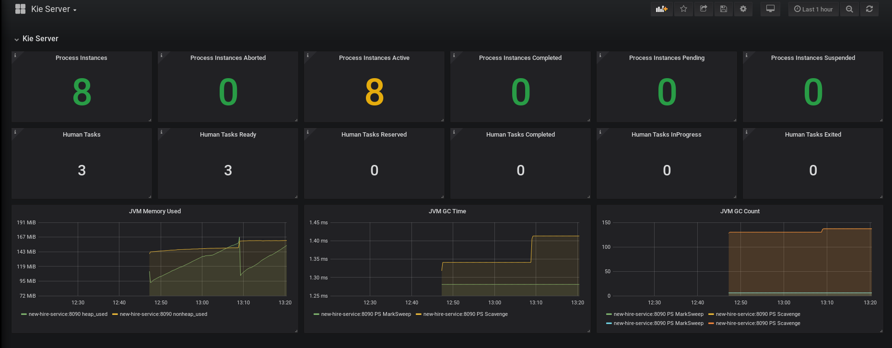

jbpm-spring-boot example
=============================

Example of a jbpm service with spring boot.<br>
The project is composed by a kjar, representing a sample new-hire BPMN process and by a kie-server running on spring boot.<br>

This is an image showing the BPMN process:


## OpenShift Environment installation

### Prerequisites

You need an OpenShift cluster version 3.11 to run the application.<br>
You can also use minishift or oc cluster.

You need the OpenShift CLI (oc command) on your machine in order to use the launch.sh script.

You need Docker on your machine to build the images.

### Install on OpenShift

When deployed on OpenShift, you will have a complete namespace with:<br>
 - Business Central
 - Kie Server
 - Prometheus, grabbing Kie Server metrics
 - Grafana, showing Kie Server Dashboard

The bash script new-hire-service/openshift/launch.sh will create an OpenShift project named "new-hire"

You only need the OpenShift admin node url, an Openshift user and the endpoint of the Openshift registry.

You can get the OpenShift registry address from the default namespace:

```bash
oc project default
oc get svc
NAME              TYPE        CLUSTER-IP      EXTERNAL-IP   PORT(S)                   AGE
docker-registry   ClusterIP   172.30.1.1      <none>        5000/TCP                  59d
```

Open the file new-hire-service/openshift/launch.sh and modify the properties:<br><br>
ocp_admin_url= --> ocp master url, example: localhost:8443<br>
ocp_docker_registry= --> ocp registry host and port, example: 172.30.1.1:5000<br>
ocp_user= --> ocp user, example: developer

according with your values.

Business central image is based on official Red Hat Process Automatation Manager Business Central image:<br>
https://registry.access.redhat.com/rhpam-7/rhpam72-businesscentral-openshift

Kie server image is based on a standard openjdk image.

Promethues image is taken form Red Hat Container Catalog:<br>
https://access.redhat.com/containers/?tab=overview#/registry.access.redhat.com/openshift3/prometheus

Grafana image is taken from:<br>
https://hub.docker.com/r/wkulhanek/grafana/

Launch the bootstrap script to create your namespace:

```bash
cd new-hire-service/openshift/
./launch.sh
```

When completed, verify that your cluster contains the following pods with state Running:

```bash
oc get pods
NAME                            READY     STATUS    RESTARTS   AGE
grafana-1-t7m5x                 1/1       Running   0          1m
jbpm-console-new-hire-1-xbp4h   1/1       Running   0          1m
new-hire-service-1-g7ml9        1/1       Running   0          1m
prometheus-1-dgbnq              1/1       Running   0          1m
```

Verify that the following routes are created:

```bash
oc get routes
NAME                    HOST/PORT                      PATH      SERVICES                PORT      TERMINATION   WILDCARD
grafana                 ClusterIP   172.30.137.176   <none>        3000/TCP                              1m
jbpm-console-new-hire   ClusterIP   172.30.196.143   <none>        8001/TCP,8080/TCP,8443/TCP,8778/TCP   2m
new-hire-service        ClusterIP   172.30.87.180    <none>        8090/TCP                              1m
prometheus              ClusterIP   172.30.170.212   <none>        9090/TCP                              1m
```

Business central (user/user) will be available at url:<br>
http://business-central.example.com

Kie server (user/user) will be available at url:<br>
http://new-hire-service.example.com

Prometheus will be available at url:<br>
http://prometheus.example.com

Grafana (admin/admin) will be available at url:<br>
http://grafana.example.com

Configure your host file (or DNS) for domain .example.com.

Grafana dashboard for kie server will look like:<br>
This is an image showing the BPMN process:


### Prometheus metrics

Process instances and human tasks basic metrics are exposed using prometheus; they are available at url:<br>
http://new-hire-service.example.com/metrics

Prometheus is already configured to scrape these metrics; verify at url:<br>
http://prometheus.example.com/targets

This is the list of metrics for kie server available:
 - Number of process instances (kie_server_process_instances)
 - Number of process instances active (kie_server_process_instances_active)
 - Number of process instances pending (kie_server_process_instances_pending)
 - Number of process instances suspended (kie_server_process_instances_suspended)
 - Number of process instances aborted (kie_server_process_instances_aborted)
 - Number of process instances completed (kie_server_process_instances_completed)
 - Number of tasks (kie_server_tasks)
 - Number of created tasks (kie_server_tasks_created)
 - Number of ready tasks (kie_server_tasks_ready)
 - Number of reserved tasks (kie_server_tasks_reserved)
 - Number of inprogress tasks (kie_server_tasks_inprogress)
 - Number of suspended tasks (kie_server_tasks_suspended)
 - Number of completed tasks (kie_server_tasks_completed)
 - Number of failed tasks (kie_server_tasks_failed)
 - Number of error tasks (kie_server_tasks_error)
 - Number of exited tasks (kie_server_tasks_exited)
 - Number of obsolete tasks (kie_server_tasks_obsolete)   

### Postman collection

A postman collection named postman_openshift.json for testing the API is available inside postman directory.

```bash
cd new-hire-service/postman
```

## Local Environment installation

### Prerequisites

You need an existing PAM business central listening at localhost:8080 (for monitoring the kie server).<br>
You need to define these two properties for the business central in order to monitor the kie-server:
```bash
<property name="org.kie.server.user" value="user"/>
<property name="org.kie.server.pwd" value="user"/>
```

### Install the kjar in your .m2 repo

```bash
  cd new-hire-kjar
  mvn clean install
```

### Define the kie server properties

The list of kie containers (groupId, artifactId version) to deploy at startup must be defined inside the new-hire-service.xml file.<br>
The kjars must exists inside your local .m2 maven repository.

Several application.properties are defined, each one with a specific database configuration:
 - h2 (default)
 - mysql
 - postgres
 - oracle

You can configure the user/password to connect with the controller (Business Central) through the following system properties inside the new-hire-service.xml file:

```bash
 org.kie.server.controller.user=<user>
 org.kie.server.controller.pwd=<password>
```


### Custom Rest endpoint

A custom rest endpoint, registered under path /rest/pam is available and it adds additional APIs to the kie server.

### Run a kie-server and deploy a kjar

```bash
  cd new-hire-service
  mvn spring-boot:run -Dorg.kie.server.startup.strategy=LocalContainersStartupStrategy -Dspring.profiles.active=h2 -Dorg.kie.server.id=new-hire-service -Ph2
```

### Run a kie-server and deploy a kjar with mysql dbms

```bash
  cd new-hire-service
  mvn spring-boot:run -Dorg.kie.server.startup.strategy=LocalContainersStartupStrategy -Dspring.profiles.active=mysql -Dorg.kie.server.id=new-hire-service -Pmysql
```

### Run a kie-server and deploy a kjar with postgres dbms

```bash
  cd new-hire-service
  mvn spring-boot:run -Dorg.kie.server.startup.strategy=LocalContainersStartupStrategy -Dspring.profiles.active=postgres -Dorg.kie.server.id=new-hire-service -Ppostgres
```

### Run a kie-server and deploy a kjar with oracle dbms

```bash
  cd new-hire-service
  mvn spring-boot:run -Dorg.kie.server.startup.strategy=LocalContainersStartupStrategy -Dspring.profiles.active=oracle -Dorg.kie.server.id=new-hire-service -Poracle
```

### Prometheus metrics

Process instances and human tasks basic metrics are exposed using prometheus; they are available at url:<br>
http://localhost:8090/metrics

### Swagger

Swagger is available at:
http://localhost:8090/rest/api-docs

load the json definition:
http://localhost:8090/rest/swagger.json

### Postman collection

A postman collection named postman.json for testing the API is available inside postman directory.

```bash
cd new-hire-service/postman
```
